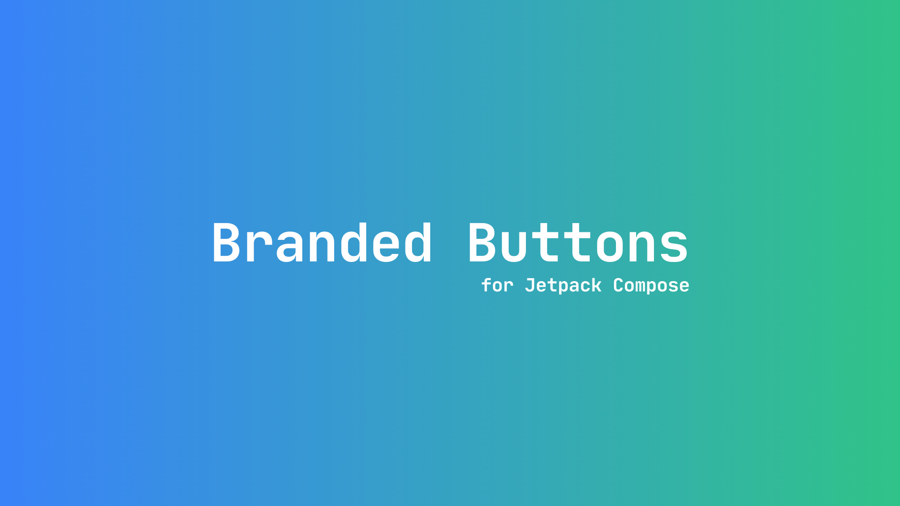
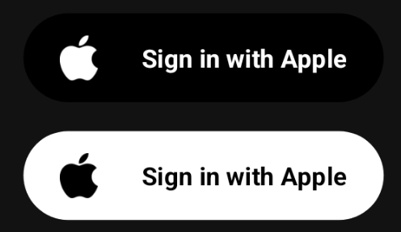
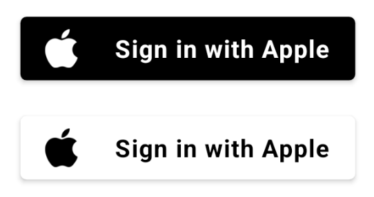

<p align = "center"> A simple library that can be used to create branded sign-in,sign-up, and "continue with" buttons. </p>

# Branded Buttons [](https://www.repostatus.org/#wip) [](https://jitpack.io/#t3chkid/branded-buttons-compose)

Branded Buttons for compose is a library that contains stylized buttons according to the specification of each brand. It allows you to create high quality social sign-in, sign-up, and "continue with" buttons. For example, you can create a Google branded button with a label that displays "Sign up with Google". Just tell the library which brand and variant is required. The library takes care of creating a button with the required brand colors and logo. In addition, it takes care of setting the appropriate semantic properties. This ensures that **the button works well with accessibility services out of the box.** Separate artifacts are available for both material 2 and material 3. 

## Accessibility
As mentioned, the buttons contain appropriate semantic properties that works well with accessibility services. For example, if a user is using the Talkback service and the UI presents one or more of the buttons from this library the talkback service will use the phrase - "{The label of the button} button". For example, if the label is set to "Sign in with Google", the talkback service will say "Sign in with Google button".

## Installation
1. Add 'https://jitpack.io' to the ```settings.gradle``` file of your project. If you have configured your project such that all project level repositories are defined in the **project level ```build.gradle```** file, then, instead of adding it to the settings.gradle file, add it to the **project level build.gradle** file.

```groovy
// settings.gradle
dependencyResolutionManagement {
    repositoriesMode.set(RepositoriesMode.FAIL_ON_PROJECT_REPOS)
    repositories {
        google()
        mavenCentral()
        maven { url 'https://jitpack.io' } // add this
    }
}
```

```groovy
// project level build.gradle
allprojects {
    repositories {
        google()
        jcenter()
        maven { url 'https://jitpack.io' } // add this
    }
}

```

2. Add the following dependencies to your app's ```build.gradle``` file.

```groovy
dependencies {

    // required dependency for both material 2 and material 3 buttons
    implementation 'com.github.t3chkid.branded-buttons-compose:branded-buttons-core:1.0.0'
    
    // dependency for material 2 buttons
    implementation 'com.github.t3chkid.branded-buttons-compose:branded-buttons-compose-m2:1.0.0'
    
    // dependency for material 3 buttons
    implementation 'com.github.t3chkid.branded-buttons-compose:branded-buttons-compose-m3:1.0.0'
}
```

## Currently available buttons

<table>
    <tr>
        <th> Brand </th>
        <th> Material 3 </th>
        <th> Material 2 </th> 
    <tr>
    <tr>
        <td> Google </td>
        <td  width = "273" height = "150"> </img> </td> 
        <td  width = "276" height = "144"> </img> </td> 
    <tr>    
    <tr>
        <td> Twitter </td>
        <td  width = "273" height = "150"> </img> </td> 
        <td  width = "276" height = "144"> </img> </td> 
    <tr>       
    <tr>
        <td> Github </td>
        <td  width = "273" height = "150"> </img> </td> 
        <td  width = "276" height = "144"> </img> </td> 
    <tr>    
    <tr>
        <td> Apple </td>
        <td  width = "273" height = "150"> </img> </td> 
        <td  width = "276" height = "144"> </img> </td> 
    <tr>  
    <tr>
        <td> Faebook </td>
        <td  width = "276" height = "144"> </img> </td> 
        <td  width = "273" height = "150"> </img> </td> 
    <tr>     
</table>


## Usage
The central API of this library is the ```BrandedButton()``` composable function. It has three mandatory arguments that allows you to specify the type of the branded button, label, and a lambda that will be executed when the button is clicked. It also has other optional parameters that allows you to customize the button.
```kotlin
@Composable
fun BrandedButton(
    brandedButtonType: BrandedButtonType,
    label: String,
    onClick: () -> Unit,
    modifier: Modifier = Modifier,
    textStyle: TextStyle = LocalTextStyle.current.copy(fontWeight = FontWeight.Bold),
    enabled: Boolean = true,
    elevation: ButtonElevation? = ButtonDefaults.elevation(),
    shape: Shape = MaterialTheme.shapes.small,
    border: BorderStroke? = null
)
```

### Example
```kotlin
// A braded Github social login button.
BrandedButton(
  brandedButtonType = BrandedButtonType.Github.DarkGithubButton,
  label = "Sign in with Github",
  onClick = {}
)
```
## Roadmap
Currently, this library is in its very early stages of development. It is also based on Material Design 2. Once the api is stable, I plan to make a separate artifact that contains buttons suitable for use with Material Design 3.
